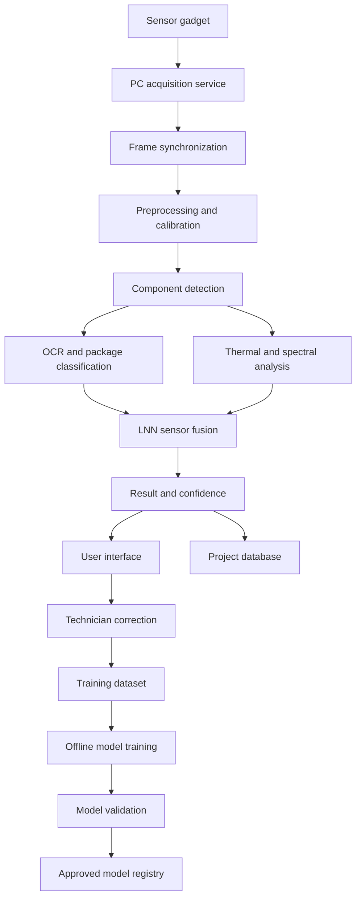
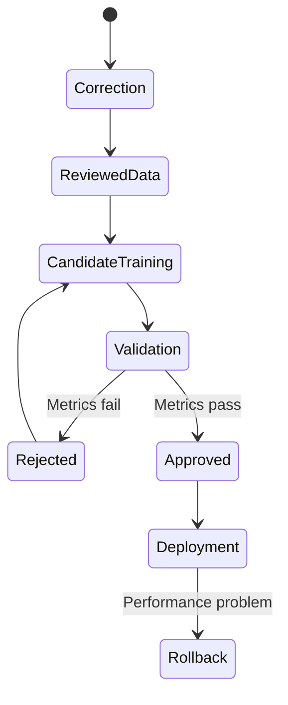

# Software structure

The software is divided into two clearly separated parts:

1. **Acquisition firmware in the gadget** — controls sensors and sends synchronized raw data.
2. **PC application** — performs recognition, visualization, storage, LNN analysis and learning.



## 1. Embedded acquisition firmware

The STM32-based gadget does not perform the main recognition. Its software remains deterministic and replaceable.

### Firmware modules

| Module | Responsibility |
|---|---|
| Device manager | Startup, configuration and hardware status |
| RGB/NIR controller | Camera exposure, focus and illumination switching |
| Thermal controller | Radiometric thermal-frame acquisition |
| Sensor manager | Distance, temperature, humidity and illumination |
| Timing manager | Common frame-set number and timestamps |
| Calibration storage | Device-specific sensor calibration values |
| Data packager | Packages images, measurements and metadata |
| Communication | USB or Ethernet transmission to the PC |
| Diagnostics | Sensor failure, dropped frame and overheating detection |
| Bootloader | Controlled and recoverable firmware updates |

### Transmitted frame set

Every measurement has one shared `frame_set_id`.

```text
FrameSet
├── device_id
├── session_id
├── frame_set_id
├── timestamp
├── rgb_image
├── nir_image
├── thermal_frame_raw
├── distance_mm
├── ambient_temperature
├── humidity
├── illumination_state
├── exposure_settings
├── calibration_id
└── sensor_status
```

Raw thermal values must be transmitted — not only a colorized thermal image.

## 2. PC application layers

### A. User-interface layer

First implementation: **Python with PySide6**.

Main screens: live inspection · RGB/NIR/thermal image viewer · component selection · recognition results · temperature history · correction and confirmation · dataset browser · calibration · model management · device diagnostics · report generation · application settings

The interface must always display:

- Recognized class and package
- Marking/OCR result
- Confidence
- Temperature and temperature trend
- Whether the result was learned, predicted or manually confirmed
- Sensor or calibration warnings

### B. Application layer

This layer coordinates workflows without containing AI implementation details.

Main services: `InspectionService` · `DeviceService` · `ProjectService` · `RecognitionService` · `CalibrationService` · `LearningService` · `ReportService` · `ModelRegistryService`

Inspection workflow:

1. Open or create a project.
2. Connect to the acquisition gadget.
3. Receive and validate a synchronized frame set.
4. Save the unmodified raw data.
5. Apply calibration and registration.
6. Detect components.
7. Run OCR and package classification.
8. Extract thermal, RGB and NIR features.
9. Process the time sequence with the LNN.
10. Present predictions and uncertainty.
11. Allow the technician to confirm or correct results.
12. Store the result as a versioned inspection record.

### C. Acquisition layer

The acquisition service runs separately from the graphical interface so that a UI crash does not corrupt a recording.

Responsibilities: device discovery · connection management · packet validation · sequence-number checking · buffer management · frame synchronization · data-loss detection · clock-difference handling · raw-data recording · device-health monitoring

Transport:

- USB for the first prototype
- Ethernet as an optional professional-product interface
- A documented binary protocol for high-volume image data
- JSON only for configuration and low-volume status messages

### D. Image-processing layer

```text
processing/
├── rgb_calibration
├── nir_normalization
├── thermal_calibration
├── lens_correction
├── image_registration
├── illumination_correction
├── glare_reduction
├── board_segmentation
├── component_cropping
└── feature_extraction
```

Calibration and registration must be completed before sensor fusion. Otherwise the system can associate a thermal hotspot with the wrong visible component.

### E. Recognition layer

The recognition pipeline contains multiple specialized models instead of one large model.

| Model | Function |
|---|---|
| Board detector | Separates PCB from background |
| Component detector | Finds components and produces bounding boxes |
| Package classifier | Identifies SOT, SOIC, QFP, BGA, resistor, capacitor, etc. |
| OCR model | Reads component markings |
| RGB/NIR classifier | Combines surface and material information |
| Thermal feature extractor | Calculates hotspot and heating characteristics |
| LNN fusion model | Analyses synchronized features over time |
| Unknown detector | Rejects unsupported or uncertain components |

The detector first locates components. The LNN processes the resulting feature sequence — not the complete high-resolution images directly.

### LNN input example

For each detected component and time step:

$$
x_t =
[\text{visual features},
\text{NIR features},
\text{OCR features},
T_{max},
T_{mean},
\Delta T,
dT/dt,
\text{ambient temperature}]
$$

The LNN produces: refined component class · package prediction · thermal-condition prediction · confidence · unknown or ambiguous status

## 3. Learning structure

The system does not automatically modify the production model after every user correction.

### Level 1 — Immediate memory

A confirmed component is stored in the project database. The system can recognize the same physical or visually similar component without retraining.

### Level 2 — Incremental candidate model

Reviewed corrections are added to a training queue. An incremental LNN or classifier is trained in a separate process.

### Level 3 — Validated production model

A candidate model becomes active only after regression testing, unknown-part testing, accuracy comparison, calibration evaluation, catastrophic-forgetting evaluation and user approval.



Every model must have a unique model ID, version, training-dataset version, supported classes, validation results, creation date, software compatibility, approval status and rollback information.

## 4. Data storage

Two storage mechanisms: **SQLite** for structured information, **project folders** for images, thermal arrays, models and reports.

### Main database tables

| Table | Content |
|---|---|
| `projects` | Customer/project information |
| `devices` | Gadget and sensor configuration |
| `sessions` | Inspection sessions |
| `frame_sets` | Synchronized acquisitions |
| `components` | Detected component regions |
| `predictions` | Model outputs and confidence |
| `ocr_results` | Markings and alternatives |
| `thermal_metrics` | Temperatures and heating trends |
| `corrections` | Technician-confirmed changes |
| `calibrations` | Calibration versions |
| `models` | Model registry |
| `training_runs` | Training configuration and results |
| `audit_log` | Important user and system actions |

### Project directory

```text
project_name/
├── project.db
├── raw/
│   ├── rgb/
│   ├── nir/
│   ├── thermal/
│   └── metadata/
├── processed/
│   ├── registered/
│   ├── components/
│   └── overlays/
├── annotations/
├── calibration/
├── models/
├── reports/
└── logs/
```

Raw data is read-only after acquisition. Processed results can be regenerated from the raw data.

## 5. Source-code layout

```text
electronic-parts-recognition/
├── apps/
│   ├── desktop/
│   ├── acquisition_service/
│   ├── training_service/
│   └── command_line_tools/
├── core/
│   ├── domain_models/
│   ├── workflows/
│   ├── configuration/
│   └── error_handling/
├── device/
│   ├── protocol/
│   ├── usb_transport/
│   ├── ethernet_transport/
│   └── simulator/
├── processing/
│   ├── calibration/
│   ├── registration/
│   ├── rgb/
│   ├── nir/
│   └── thermal/
├── recognition/
│   ├── detection/
│   ├── classification/
│   ├── ocr/
│   ├── lnn/
│   ├── fusion/
│   └── unknown_detection/
├── learning/
│   ├── dataset_builder/
│   ├── annotation/
│   ├── training/
│   ├── validation/
│   └── model_registry/
├── storage/
│   ├── database/
│   ├── repositories/
│   └── file_storage/
├── reporting/
├── tests/
│   ├── unit/
│   ├── integration/
│   ├── hardware_in_loop/
│   └── regression/
├── firmware/
├── documentation/
└── deployment/
```

## 6. Technology

| Area | Initial recommendation |
|---|---|
| Desktop interface | Python and PySide6 |
| Image processing | OpenCV |
| AI development | PyTorch |
| Production inference | ONNX Runtime |
| LNN implementation | PyTorch-based custom module or established LTC/CfC implementation |
| Database | SQLite |
| Data validation | Typed Python data models |
| Reports | HTML/PDF export |
| Testing | Pytest |
| Packaging | Windows installer |
| Version control | Git |
| Experiment tracking | Local experiment database initially |
| Configuration | Versioned YAML or JSON files |

For the first prototype, avoid Kubernetes, cloud services and microservices. A modular desktop application with separate acquisition and training processes is sufficient and much easier to maintain.

## 7. Development order

1. Define the frame-set and communication protocol.
2. Create a simulated gadget.
3. Implement PC acquisition and raw recording.
4. Add RGB and thermal display.
5. Implement calibration and image registration.
6. Add component detection.
7. Add package classification and OCR.
8. Add thermal measurements.
9. Collect time-series data.
10. Integrate the LNN.
11. Add correction and annotation functions.
12. Implement controlled retraining.
13. Add model validation and rollback.
14. Complete reporting, installer and system tests.

The simulator is important: PC software development continues even when the physical gadget is unavailable or being modified.
